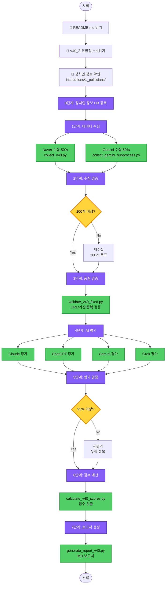

# V40 문서 관계도

**생성일**: 2026-02-10
**목적**: V40 시스템의 모든 문서와 스크립트 간 연결 관계를 시각화하여 다른 Claude Code 세션이 쉽게 참조할 수 있도록 함

---

## 📊 전체 구조 (계층적 관계도)

```mermaid
graph TD
    %% 최상위 허브
    README[🌟 README.md<br/>V40 시스템 허브]

    %% 1계층: 핵심 방침 문서
    README --> BASIC[📋 V40_기본방침.md<br/>핵심 규칙]
    README --> PROCESS[📋 V40_전체_프로세스_가이드.md<br/>7단계 프로세스]
    README --> ORCH[📋 V40_오케스트레이션_가이드.md<br/>자동화 가이드]
    README --> TERM[📋 TERMINOLOGY.md<br/>용어 정의]

    %% 2계층: 정치인 정보
    README --> POL_DIR[📁 instructions/1_politicians/]
    POL_DIR --> POL_TEMP[📄 _TEMPLATE.md]
    POL_DIR --> POL_JO[📄 조은희.md]
    POL_DIR --> POL_PARK[📄 박주민.md]

    %% 3계층: 수집 (Collection)
    README --> COLLECT_DIR[📁 instructions/2_collect/]
    COLLECT_DIR --> GEMINI_GUIDE[📄 GEMINI_CLI_수집_가이드.md]
    COLLECT_DIR --> NAVER_GUIDE[📄 NAVER_API_수집_가이드.md]
    COLLECT_DIR --> COLLECT_CATS[📄 cat01~10.md<br/>10개 카테고리]
    COLLECT_DIR --> PROMPTS[📁 prompts/]
    PROMPTS --> PROMPT_G_OFF[📄 gemini_official.md]
    PROMPTS --> PROMPT_G_PUB[📄 gemini_public.md]
    PROMPTS --> PROMPT_N_OFF[📄 naver_official.md]
    PROMPTS --> PROMPT_N_PUB[📄 naver_public.md]

    %% 4계층: 수집 스크립트
    COLLECT_DIR --> COLLECT_V40[⚙️ ../../collect_v40.py<br/>Naver 수집]
    COLLECT_DIR --> COLLECT_GEM[⚙️ workflow/collect_gemini_subprocess.py<br/>Gemini 단일]
    COLLECT_DIR --> COLLECT_GEM_PAR[⚙️ workflow/collect_gemini_subprocess_parallel.py<br/>Gemini 병렬]

    %% 5계층: 검증
    README --> VALIDATE[⚙️ core/validate_v40_fixed.py<br/>수집 검증]
    PROCESS --> VALIDATE

    %% 6계층: 평가 (Evaluation)
    README --> EVAL_DIR[📁 instructions/3_evaluate/]
    EVAL_DIR --> CLAUDE_EVAL[📄 Claude_평가_종합가이드_V40.md]
    EVAL_DIR --> GEMINI_EVAL_GUIDE[📄 Gemini_CLI_평가_작업방법.md]
    EVAL_DIR --> EVAL_CATS[📄 cat01~10.md<br/>10개 카테고리]

    %% 7계층: 평가 스크립트
    EVAL_DIR --> EVAL_V40[⚙️ core/evaluate_v40.py<br/>API 평가]
    EVAL_DIR --> EVAL_GEM[⚙️ workflow/evaluate_gemini_subprocess.py<br/>Gemini 평가]
    EVAL_DIR --> CLAUDE_HELPER[⚙️ helpers/claude_eval_helper.py]
    EVAL_DIR --> GEMINI_HELPER[⚙️ helpers/gemini_eval_helper.py]

    %% 8계층: 점수 계산
    README --> CALC[⚙️ core/calculate_v40_scores.py<br/>점수 계산]
    EVAL_V40 --> CALC

    %% 9계층: 보고서
    README --> REPORT_DIR[📁 보고서/]
    REPORT_DIR --> REPORT_GUIDE[📄 V40_보고서_작성_가이드.md]
    REPORT_DIR --> REPORT_GEN[⚙️ core/generate_report_v40.py<br/>보고서 생성]
    CALC --> REPORT_GEN

    %% 10계층: 자동화 워크플로우
    README --> WORKFLOW[⚙️ workflow/run_v40_workflow.py<br/>전체 자동화]
    WORKFLOW --> COLLECT_V40
    WORKFLOW --> COLLECT_GEM_PAR
    WORKFLOW --> VALIDATE
    WORKFLOW --> EVAL_V40
    WORKFLOW --> EVAL_GEM
    WORKFLOW --> CALC
    WORKFLOW --> REPORT_GEN

    %% 스타일
    classDef hub fill:#ff6b6b,stroke:#c92a2a,stroke-width:3px,color:#fff
    classDef doc fill:#4dabf7,stroke:#1971c2,stroke-width:2px,color:#fff
    classDef script fill:#51cf66,stroke:#2f9e44,stroke-width:2px,color:#000
    classDef folder fill:#ffd43b,stroke:#f08c00,stroke-width:2px,color:#000

    class README hub
    class BASIC,PROCESS,ORCH,TERM,GEMINI_GUIDE,NAVER_GUIDE,CLAUDE_EVAL,GEMINI_EVAL_GUIDE,REPORT_GUIDE,POL_TEMP,POL_JO,POL_PARK doc
    class COLLECT_V40,COLLECT_GEM,COLLECT_GEM_PAR,VALIDATE,EVAL_V40,EVAL_GEM,CALC,REPORT_GEN,WORKFLOW,CLAUDE_HELPER,GEMINI_HELPER script
    class POL_DIR,COLLECT_DIR,PROMPTS,EVAL_DIR,REPORT_DIR folder
```

---

## 🔄 프로세스 플로우 (실행 순서)

---

## 📂 디렉토리별 문서 분류

### 1. 핵심 문서 (Root)
| 파일명 | 역할 | 참조 대상 |
|--------|------|-----------|
| **README.md** | 🌟 전체 시스템 허브 | 모든 문서의 시작점 |
| TERMINOLOGY.md | 용어 정의 | 수집/평가 용어 통일 |

### 2. 기본 방침 (instructions/)
| 파일명 | 역할 | 참조 대상 |
|--------|------|-----------|
| V40_기본방침.md | 핵심 규칙 정의 | README → 이 문서 → 상세 가이드 |
| V40_전체_프로세스_가이드.md | 7단계 프로세스 상세 | 실행 시 참조 |
| V40_오케스트레이션_가이드.md | 자동화 가이드 | workflow 스크립트 작성 시 |

### 3. 정치인 정보 (instructions/1_politicians/)
| 파일명 | 역할 | 참조 대상 |
|--------|------|-----------|
| _TEMPLATE.md | 새 정치인 추가 템플릿 | 신규 정치인 작성 시 복사 |
| 조은희.md | 조은희 정보 | 수집/평가 시 자동 참조 |
| 박주민.md | 박주민 정보 | 수집/평가 시 자동 참조 |

### 4. 수집 (instructions/2_collect/)
| 파일명 | 역할 | 참조 대상 |
|--------|------|-----------|
| GEMINI_CLI_수집_가이드.md | Gemini 수동 수집 절차 | collect_gemini_subprocess.py |
| NAVER_API_수집_가이드.md | Naver API 수집 절차 | collect_v40.py |
| cat01~10.md | 10개 카테고리 정의 | 수집 시 범위 참조 |
| prompts/gemini_official.md | Gemini OFFICIAL 프롬프트 | Gemini 수집 |
| prompts/gemini_public.md | Gemini PUBLIC 프롬프트 | Gemini 수집 |
| prompts/naver_official.md | Naver OFFICIAL 프롬프트 | Naver 수집 |
| prompts/naver_public.md | Naver PUBLIC 프롬프트 | Naver 수집 |

### 5. 평가 (instructions/3_evaluate/)
| 파일명 | 역할 | 참조 대상 |
|--------|------|-----------|
| Claude_평가_종합가이드_V40.md | Claude Haiku 4.5 평가 (CLI Direct / Skill) | claude_eval_helper.py, `/evaluate-politician-v40` |
| Gemini_CLI_평가_작업방법.md | Gemini 2.0 Flash Subprocess 평가 | evaluate_gemini_subprocess.py |
| cat01~10.md | 10개 카테고리 평가 기준 | 평가 시 등급 기준 |

### 6. 보고서 (보고서/)
| 파일명 | 역할 | 참조 대상 |
|--------|------|-----------|
| V40_보고서_작성_가이드.md | 보고서 작성 규칙 | generate_report_v40.py |
| HTML_개선_적용_가이드.md | HTML 출력 가이드 | HTML 변환 시 |
| PDF생성_사용법.md | PDF 변환 가이드 | PDF 생성 시 |

### 7. 스크립트 (scripts/)
| 경로 | 파일명 | 역할 |
|------|--------|------|
| workflow/ | run_v40_workflow.py | 🌟 전체 자동화 (권장) |
| workflow/ | collect_gemini_subprocess.py | Gemini 단일 수집 |
| workflow/ | collect_gemini_subprocess_parallel.py | Gemini 병렬 수집 |
| workflow/ | evaluate_gemini_subprocess.py | Gemini 평가 |
| core/ | validate_v40_fixed.py | 수집 검증 |
| core/ | calculate_v40_scores.py | 점수 계산 |
| core/ | generate_report_v40.py | 보고서 생성 |
| helpers/ | claude_eval_helper.py | Claude Haiku 4.5 평가 (API / CLI Direct) |
| helpers/ | codex_eval_helper.py | ChatGPT gpt-5.1-codex-mini 평가 (CLI stdin, $0.05/$0.40/1M) |
| helpers/ | grok_eval_helper.py | Grok 2 평가 (xAI API) |
| helpers/ | gemini_eval_helper.py | Gemini 2.0 Flash DB 조회/저장 (수동용) |
| helpers/ | duplicate_check_utils.py | 중복 체크 |

---

## 🔗 참조 관계 요약

### 새 세션 시작 시 읽어야 할 순서

1. **README.md** (이 문서부터 시작) ← 🌟 **시작점**
2. **V40_기본방침.md** (핵심 규칙 파악)
3. **정치인 정보** (instructions/1_politicians/{이름}.md)
4. **V40_전체_프로세스_가이드.md** (상세 프로세스)

### 작업별 참조 문서

| 작업 | 읽어야 할 문서 |
|------|---------------|
| **수집** | GEMINI_CLI_수집_가이드.md, NAVER_API_수집_가이드.md, cat01~10.md, prompts/ |
| **검증** | V40_전체_프로세스_가이드.md (검증 규칙 섹션) |
| **평가** | Claude_평가_종합가이드_V40.md, Gemini_CLI_평가_작업방법.md, cat01~10.md |
| **점수 계산** | V40_기본방침.md (점수 공식) |
| **보고서 생성** | V40_보고서_작성_가이드.md |
| **전체 자동화** | V40_오케스트레이션_가이드.md |

---

## 📌 핵심 원칙

**⚠️⚠️⚠️ 새 세션 시작 시 반드시 읽어야 할 문서 (필수!) ⚠️⚠️⚠️**

**모든 Claude Code 세션은 작업 시작 전에 다음 5개 문서를 반드시 순서대로 읽어야 합니다:**

1. **README.md** (V40/) ⭐ 필독!
2. **V40_문서_관계도.md** (V40/) ⭐ 필독!
3. **V40_기본방침.md** (instructions/) ⭐ 필독!
4. **V40_전체_프로세스_가이드.md** (instructions/) ⭐ 필독!
5. **V40_오케스트레이션_가이드.md** (instructions/) ⭐ 필독!

**이 5개 문서를 읽지 않고 작업하면 오류가 발생합니다!**

---

**이 관계도를 사용하는 방법:**

1. **새 세션 시작**: CLAUDE.md 읽기 → 위 5개 필수 문서 순서대로 읽기
2. **특정 작업 수행**: 작업별 참조 문서 테이블 확인
3. **스크립트 실행**: 해당 스크립트의 참조 문서 먼저 읽기
4. **문제 해결**: 프로세스 플로우 다이어그램 참조

**문서 간 일관성:**
- 모든 문서는 README.md의 정의를 따름
- OFFICIAL: 4년, PUBLIC: 2년 (수집일 기준)
- 등급: +4 ~ -4 (점수 = 등급 × 2)
- 수집: Gemini 50% + Naver 50%
- 평가: Claude (Haiku 4.5), ChatGPT (gpt-5.1-codex-mini), Gemini (2.0 Flash), Grok (Grok 2) - 4개 AI
- 배치 크기: API 25개, Gemini Subprocess 50개, Claude Skill 50개

---

**생성일**: 2026-02-10
**생성 목적**: 다른 Claude Code 세션이 V40 시스템의 문서 구조를 빠르게 파악하고 올바른 문서를 참조할 수 있도록 함
