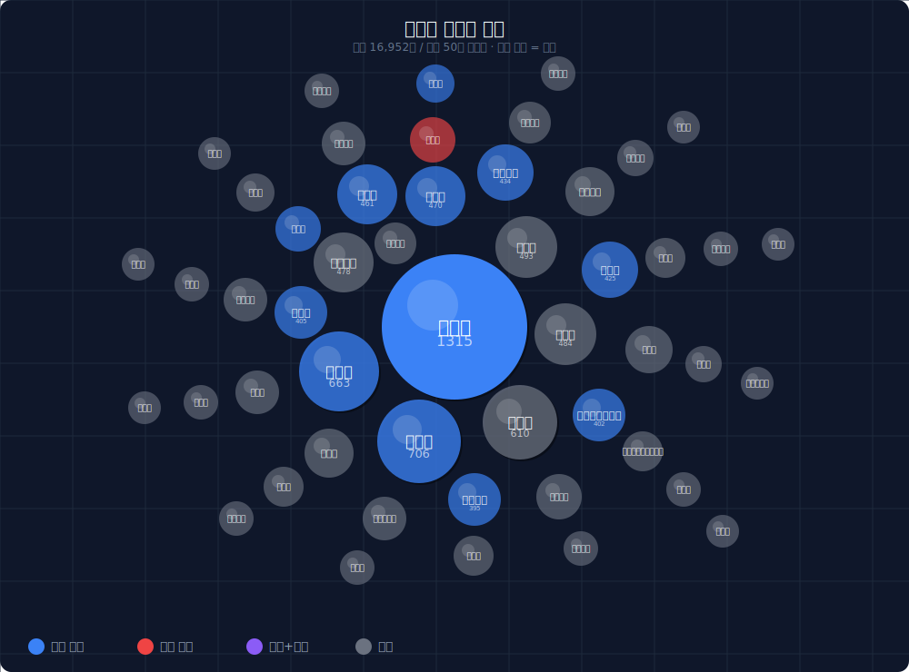

# 박주민 AI 기반 정치인 상세평가보고서 (당사자 전용)

> 🔒 이 보고서는 당사자 전용 비공개 문서입니다.

**평가 버전**: V40  |  **평가 일자**: 2026-02-19
**총 평가 수**: 4,544개 (4 AI × 약 1,136개)
**평가 AI**: Claude · ChatGPT · Grok · Gemini

---

## 1. 정치인 프로필

| 항목 | 내용 |
|------|------|
| **이름** | 박주민 |
| **소속 정당** | 더불어민주당 |
| **현직** | 국회의원 |
| **지역구** | 서울특별시 |
| **이전 직책** | 변호사 |

### 주요 경력

---

## 2. 평가 요약

### 최종 점수 및 등급

| 항목 | 내용 |
|------|------|
| **최종 점수** | **753점** / 1,000점 |
| **등급** | **P (보통+)** |
| **4 AI 평균 rating** | +1.56 → avg_score +3.11 |

> **점수 공식**: avg_rating × 2 = avg_score → (6.0 + avg_score × 0.5) × 10 = 카테고리 점수

### 10개 카테고리 점수 (높은 순)

```
공익성      ████████░░ 81점
투명성      ███████░░░ 79점
소통능력     ███████░░░ 77점
전문성      ███████░░░ 75점
비전       ███████░░░ 75점
리더십      ███████░░░ 75점
대응성      ███████░░░ 75점
책임감      ███████░░░ 74점
청렴성      ███████░░░ 72점
윤리성      ███████░░░ 71점
```
*(막대 1칸 = 10점)*

### AI별 점수 상세

| AI | 점수 | avg_rating | avg_score |
|---|:---:|:----------:|:---------:|
| Gemini | 782점 | +1.87 | +3.73 |
| ChatGPT | 764점 | +1.63 | +3.27 |
| Claude | 741점 | +1.44 | +2.87 |
| Grok | 728점 | +1.28 | +2.57 |
| **4 AI 평균** | **753점** | **+1.56** | **+3.11** |

### AI 합의 신뢰도

> **방향 합의** 기준: 4개 AI 모두 같은 방향(긍정/부정)으로 평가한 카테고리

- **AI 방향 합의 카테고리**: 리더십, 전문성, 청렴성 (표준편차 < 3점)
- **AI 이견 카테고리**: 비전 (표준편차 5.7점)
- **유효 데이터**: 3,637개 / 전체 4,544개 (80.0%)

---

## 2026 서울시장 유력 후보군 비교

> ℹ️ 비교군 선정 기준: 2026 서울시장 여론조사 지지율 상위 4인 (언론 보도 기준)
> ⚠️ 평가 대상 정치인은 비교군 목록에서 자동 제외 후 별도 ★ 표시

### 종합 점수 순위

| 순위 | 후보 | 점수 | 등급 |
|:----:|------|:----:|:----:|
| 1 | 정원오 | 785점 | E (양호) |
| **★2** | **박주민** | **753점** | **P (보통+)** |
| 3 | 조은희 | 745점 | P (보통+) |
| 4 | 오세훈 | 732점 | P (보통+) |

### 카테고리별 비교 (10개)

| 카테고리 | 박주민 | 정원오 | 조은희 | 오세훈 |
|---------|:------:|:------:|:------:|:------:|
| 전문성 | 75 | 81 | 76 | 75 |
| 리더십 | 75 | 79 | 78 | 71 |
| 비전 | 75 | 76 | 74 | 80 |
| 청렴성 | 72 | 73 | 68 | 66 |
| 윤리성 | 71 | 69 | 66 | 66 |
| 책임감 | 74 | 81 | 79 | 74 |
| 투명성 | 79 | 80 | 76 | 71 |
| 소통능력 | 77 | 81 | 75 | 76 |
| 대응성 | 75 | 82 | 75 | 75 |
| 공익성 | 81 | 83 | 78 | 77 |

---

## 3. 강점 분석

### 강점 1: 공익성 (81점)

#### 점수 현황
- 4개 AI 평균 **81점** — 10개 카테고리 중 **1위**
- AI별 점수: Claude 74점 · ChatGPT 83점 · Grok 80점 · Gemini 87점

#### AI 평가 일치도 (평가 분산)
- 표준편차 **5.5점**
- 최고 AI: Gemini (87점) / 최저 AI: Claude (74점) — 격차 13점

#### 등급 분포 스펙트럼
```
+4: 42건 | +3: 120건 | +2: 149건 | +1: 59건 | -1: 11건 | -2: 6건 | -3: 3건 | -4: 1건
```
- 긍정(370건 / 83%) · 부정(21건 / 5%) · 제외 X(57건)
- 극단성 지수 — 탁월(+4): 42건 / 최악(-4): 1건

### 강점 2: 투명성 (79점)

#### 점수 현황
- 4개 AI 평균 **79점** — 10개 카테고리 중 **2위**
- AI별 점수: Claude 77점 · ChatGPT 77점 · Grok 77점 · Gemini 84점

#### AI 평가 일치도 (중간 합의)
- 표준편차 **3.5점**
- 최고 AI: Gemini (84점) / 최저 AI: Claude (77점) — 격차 7점

#### 등급 분포 스펙트럼
```
+4: 17건 | +3: 89건 | +2: 148건 | +1: 90건 | -1: 17건 | -2: 4건
```
- 긍정(344건 / 75%) · 부정(21건 / 5%) · 제외 X(91건)
- 극단성 지수 — 탁월(+4): 17건 / 최악(-4): 0건

### 강점 3: 소통능력 (77점)

#### 점수 현황
- 4개 AI 평균 **77점** — 10개 카테고리 중 **3위**
- AI별 점수: Claude 73점 · ChatGPT 78점 · Grok 73점 · Gemini 83점

#### AI 평가 일치도 (중간 합의)
- 표준편차 **4.8점**
- 최고 AI: Gemini (83점) / 최저 AI: Claude (73점) — 격차 10점

#### 등급 분포 스펙트럼
```
+4: 24건 | +3: 90건 | +2: 123건 | +1: 83건 | -1: 35건 | -2: 9건 | -3: 5건 | -4: 2건
```
- 긍정(320건 / 71%) · 부정(51건 / 11%) · 제외 X(81건)
- 극단성 지수 — 탁월(+4): 24건 / 최악(-4): 2건

### 강점 4: 전문성 (75점)

#### 점수 현황
- 4개 AI 평균 **75점** — 10개 카테고리 중 **4위**
- AI별 점수: Claude 75점 · ChatGPT 76점 · Grok 74점 · Gemini 76점

#### AI 평가 일치도 (강한 합의)
- 표준편차 **1.0점**
- 최고 AI: ChatGPT (76점) / 최저 AI: Grok (74점) — 격차 2점

#### 등급 분포 스펙트럼
```
+4: 6건 | +3: 86건 | +2: 105건 | +1: 164건 | -1: 28건 | -2: 11건
```
- 긍정(361건 / 82%) · 부정(39건 / 9%) · 제외 X(40건)
- 극단성 지수 — 탁월(+4): 6건 / 최악(-4): 0건

### 강점 5: 비전 (75점)

#### 점수 현황
- 4개 AI 평균 **75점** — 10개 카테고리 중 **5위**
- AI별 점수: Claude 80점 · ChatGPT 78점 · Grok 67점 · Gemini 76점

#### AI 평가 일치도 (평가 분산)
- 표준편차 **5.7점**
- 최고 AI: Claude (80점) / 최저 AI: Grok (67점) — 격차 13점

#### 등급 분포 스펙트럼
```
+4: 24건 | +3: 93건 | +2: 107건 | +1: 91건 | -1: 61건 | -2: 20건 | -3: 1건
```
- 긍정(315건 / 69%) · 부정(82건 / 18%) · 제외 X(59건)
- 극단성 지수 — 탁월(+4): 24건 / 최악(-4): 0건

---

## 4. 약점 분석

### 약점 1: 책임감 (74점)

#### 점수 현황
- 4개 AI 평균 **74점** — 10개 카테고리 중 하위 **8위**
- AI별 점수: Claude 70점 · ChatGPT 75점 · Grok 74점 · Gemini 77점

#### AI 평가 편차 (강한 합의)
- 표준편차 **2.9점** — AI 간 최대 격차: 7점

#### 등급 분포 스펙트럼
```
+4: 7건 | +3: 72건 | +2: 140건 | +1: 132건 | -1: 17건 | -2: 21건 | -3: 7건 | -4: 1건
```
- 긍정(351건 / 73%) · 부정(46건 / 10%) · 제외 X(83건)
- 극단성 지수 — 탁월(+4): 7건 / 최악(-4): 1건

### 약점 2: 청렴성 (72점)

#### 점수 현황
- 4개 AI 평균 **72점** — 10개 카테고리 중 하위 **9위**
- AI별 점수: Claude 72점 · ChatGPT 72점 · Grok 70점 · Gemini 72점

#### AI 평가 편차 (강한 합의)
- 표준편차 **1.0점** — AI 간 최대 격차: 2점

#### 등급 분포 스펙트럼
```
+3: 16건 | +2: 69건 | +1: 185건 | -1: 11건 | -2: 10건 | -3: 2건
```
- 긍정(270건 / 57%) · 부정(23건 / 5%) · 제외 X(179건)
- 극단성 지수 — 탁월(+4): 0건 / 최악(-4): 0건

### 약점 3: 윤리성 (71점)

#### 점수 현황
- 4개 AI 평균 **71점** — 10개 카테고리 중 하위 **10위**
- AI별 점수: Claude 71점 · ChatGPT 73점 · Grok 69점 · Gemini 72점

#### AI 평가 편차 (강한 합의)
- 표준편차 **1.7점** — AI 간 최대 격차: 4점

#### 등급 분포 스펙트럼
```
+4: 2건 | +3: 30건 | +2: 113건 | +1: 118건 | -1: 33건 | -2: 22건 | -3: 3건
```
- 긍정(263건 / 59%) · 부정(58건 / 13%) · 제외 X(127건)
- 극단성 지수 — 탁월(+4): 2건 / 최악(-4): 0건

---

## 5. 카테고리별 상세

### 5.1 전문성 (75점)

#### AI별 등급 분포 스펙트럼

| AI | +4 | +3 | +2 | +1 | -1 | -2 | -3 | -4 | 점수 |
|---|:--:|:--:|:--:|:--:|:--:|:--:|:--:|:--:|:----:|
| Claude | 0 | 34 | 9 | 56 | 9 | 1 | 0 | 0 | 75점 |
| ChatGPT | 0 | 13 | 47 | 40 | 1 | 3 | 0 | 0 | 76점 |
| Grok | 0 | 16 | 32 | 41 | 7 | 4 | 0 | 0 | 74점 |
| Gemini | 6 | 23 | 17 | 27 | 11 | 3 | 0 | 0 | 76점 |
| **합계** | - | - | - | - | - | - | - | - | **75점** |

전체 440개: 긍정 361건(82%) · 부정 39건(9%) · X 40건(9%)

### 5.2 리더십 (75점)

#### AI별 등급 분포 스펙트럼

| AI | +4 | +3 | +2 | +1 | -1 | -2 | -3 | -4 | 점수 |
|---|:--:|:--:|:--:|:--:|:--:|:--:|:--:|:--:|:----:|
| Claude | 0 | 10 | 43 | 28 | 3 | 5 | 0 | 0 | 75점 |
| ChatGPT | 0 | 13 | 46 | 46 | 1 | 6 | 0 | 0 | 75점 |
| Grok | 0 | 12 | 44 | 38 | 6 | 6 | 0 | 0 | 74점 |
| Gemini | 6 | 22 | 34 | 27 | 4 | 5 | 3 | 0 | 76점 |
| **합계** | - | - | - | - | - | - | - | - | **75점** |

전체 448개: 긍정 369건(82%) · 부정 39건(9%) · X 40건(9%)

### 5.3 비전 (75점)

#### AI별 등급 분포 스펙트럼

| AI | +4 | +3 | +2 | +1 | -1 | -2 | -3 | -4 | 점수 |
|---|:--:|:--:|:--:|:--:|:--:|:--:|:--:|:--:|:----:|
| Claude | 3 | 22 | 28 | 9 | 2 | 4 | 0 | 0 | 80점 |
| ChatGPT | 7 | 30 | 28 | 38 | 3 | 5 | 0 | 0 | 78점 |
| Grok | 3 | 16 | 23 | 21 | 41 | 6 | 0 | 0 | 67점 |
| Gemini | 11 | 25 | 28 | 23 | 15 | 5 | 1 | 0 | 76점 |
| **합계** | - | - | - | - | - | - | - | - | **75점** |

전체 456개: 긍정 315건(69%) · 부정 82건(18%) · X 59건(13%)

### 5.4 청렴성 (72점)

#### AI별 등급 분포 스펙트럼

| AI | +4 | +3 | +2 | +1 | -1 | -2 | -3 | -4 | 점수 |
|---|:--:|:--:|:--:|:--:|:--:|:--:|:--:|:--:|:----:|
| Claude | 0 | 3 | 10 | 16 | 2 | 2 | 0 | 0 | 72점 |
| ChatGPT | 0 | 5 | 34 | 70 | 4 | 5 | 0 | 0 | 72점 |
| Grok | 0 | 3 | 13 | 56 | 5 | 2 | 0 | 0 | 70점 |
| Gemini | 0 | 5 | 12 | 43 | 0 | 1 | 2 | 0 | 72점 |
| **합계** | - | - | - | - | - | - | - | - | **72점** |

전체 472개: 긍정 270건(57%) · 부정 23건(5%) · X 179건(38%)

### 5.5 윤리성 (71점)

#### AI별 등급 분포 스펙트럼

| AI | +4 | +3 | +2 | +1 | -1 | -2 | -3 | -4 | 점수 |
|---|:--:|:--:|:--:|:--:|:--:|:--:|:--:|:--:|:----:|
| Claude | 0 | 3 | 28 | 15 | 11 | 2 | 0 | 0 | 71점 |
| ChatGPT | 1 | 16 | 40 | 39 | 8 | 7 | 0 | 0 | 73점 |
| Grok | 0 | 1 | 26 | 62 | 10 | 8 | 0 | 0 | 69점 |
| Gemini | 1 | 10 | 19 | 2 | 4 | 5 | 3 | 0 | 72점 |
| **합계** | - | - | - | - | - | - | - | - | **71점** |

전체 448개: 긍정 263건(59%) · 부정 58건(13%) · X 127건(28%)

### 5.6 책임감 (74점)

#### AI별 등급 분포 스펙트럼

| AI | +4 | +3 | +2 | +1 | -1 | -2 | -3 | -4 | 점수 |
|---|:--:|:--:|:--:|:--:|:--:|:--:|:--:|:--:|:----:|
| Claude | 0 | 0 | 23 | 32 | 7 | 2 | 0 | 0 | 70점 |
| ChatGPT | 0 | 17 | 51 | 37 | 1 | 7 | 2 | 0 | 75점 |
| Grok | 0 | 21 | 35 | 41 | 5 | 9 | 0 | 0 | 74점 |
| Gemini | 7 | 34 | 31 | 22 | 4 | 3 | 5 | 1 | 77점 |
| **합계** | - | - | - | - | - | - | - | - | **74점** |

전체 480개: 긍정 351건(73%) · 부정 46건(10%) · X 83건(17%)

### 5.7 투명성 (79점)

#### AI별 등급 분포 스펙트럼

| AI | +4 | +3 | +2 | +1 | -1 | -2 | -3 | -4 | 점수 |
|---|:--:|:--:|:--:|:--:|:--:|:--:|:--:|:--:|:----:|
| Claude | 0 | 9 | 22 | 18 | 2 | 0 | 0 | 0 | 77점 |
| ChatGPT | 2 | 20 | 41 | 42 | 3 | 1 | 0 | 0 | 77점 |
| Grok | 4 | 20 | 52 | 21 | 10 | 2 | 0 | 0 | 77점 |
| Gemini | 11 | 40 | 33 | 9 | 2 | 1 | 0 | 0 | 84점 |
| **합계** | - | - | - | - | - | - | - | - | **79점** |

전체 456개: 긍정 344건(75%) · 부정 21건(5%) · X 91건(20%)

### 5.8 소통능력 (77점)

#### AI별 등급 분포 스펙트럼

| AI | +4 | +3 | +2 | +1 | -1 | -2 | -3 | -4 | 점수 |
|---|:--:|:--:|:--:|:--:|:--:|:--:|:--:|:--:|:----:|
| Claude | 0 | 3 | 33 | 36 | 6 | 0 | 0 | 0 | 73점 |
| ChatGPT | 1 | 29 | 43 | 28 | 1 | 4 | 1 | 0 | 78점 |
| Grok | 0 | 32 | 32 | 13 | 22 | 5 | 1 | 0 | 73점 |
| Gemini | 23 | 26 | 15 | 6 | 6 | 0 | 3 | 2 | 83점 |
| **합계** | - | - | - | - | - | - | - | - | **77점** |

전체 452개: 긍정 320건(71%) · 부정 51건(11%) · X 81건(18%)

### 5.9 대응성 (75점)

#### AI별 등급 분포 스펙트럼

| AI | +4 | +3 | +2 | +1 | -1 | -2 | -3 | -4 | 점수 |
|---|:--:|:--:|:--:|:--:|:--:|:--:|:--:|:--:|:----:|
| Claude | 0 | 9 | 19 | 21 | 7 | 0 | 0 | 0 | 74점 |
| ChatGPT | 0 | 23 | 36 | 16 | 0 | 7 | 0 | 0 | 77점 |
| Grok | 4 | 16 | 16 | 20 | 20 | 7 | 0 | 0 | 70점 |
| Gemini | 11 | 21 | 20 | 10 | 5 | 4 | 2 | 0 | 79점 |
| **합계** | - | - | - | - | - | - | - | - | **75점** |

전체 444개: 긍정 242건(55%) · 부정 52건(12%) · X 150건(34%)

### 5.10 공익성 (81점)

#### AI별 등급 분포 스펙트럼

| AI | +4 | +3 | +2 | +1 | -1 | -2 | -3 | -4 | 점수 |
|---|:--:|:--:|:--:|:--:|:--:|:--:|:--:|:--:|:----:|
| Claude | 0 | 1 | 38 | 34 | 3 | 0 | 0 | 0 | 74점 |
| ChatGPT | 16 | 33 | 45 | 12 | 2 | 2 | 1 | 0 | 83점 |
| Grok | 5 | 33 | 51 | 10 | 5 | 2 | 1 | 0 | 80점 |
| Gemini | 21 | 53 | 15 | 3 | 1 | 2 | 1 | 1 | 87점 |
| **합계** | - | - | - | - | - | - | - | - | **81점** |

전체 448개: 긍정 370건(83%) · 부정 21건(5%) · X 57건(13%)

---

## 6. 키워드 지도

> 수집 데이터 1,136개 + AI 평가 reasoning 전체에서 추출 · 버블 크기 = 빈도



> 🔵 파란색 = 긍정(+3/+4) 연관 · 🔴 빨간색 = 부정(-3/-4) 연관 · 🟣 보라색 = 긍정+부정 공존 · ⚫ 회색 = 중립

### 6.1 빈출 키워드 TOP 20

| 순위 | 키워드 | 빈도 | 빈도 바 |
|:----:|--------|:----:|--------|
| 1 | **개정안** | 1315회 | ▓▓▓▓▓▓▓▓▓▓▓▓ |
| 2 | **토론회** | 706회 | ▓▓▓▓▓▓ |
| 3 | **사회적** | 663회 | ▓▓▓▓▓▓ |
| 4 | 적극적 | 610회 | ▓▓▓▓▓ |
| 5 | 간담회 | 493회 | ▓▓▓▓ |
| 6 | 인터뷰 | 484회 | ▓▓▓▓ |
| 7 | 기자회견 | 478회 | ▓▓▓▓ |
| 8 | **피해자** | 470회 | ▓▓▓▓ |
| 9 | **공익적** | 461회 | ▓▓▓▓ |
| 10 | **사실적시** | 434회 | ▓▓▓ |
| 11 | **발의로** | 425회 | ▓▓▓ |
| 12 | **추진력** | 405회 | ▓▓▓ |
| 13 | **보건복지위원장** | 402회 | ▓▓▓ |
| 14 | **해당한다** | 395회 | ▓▓▓ |
| 15 | 공정성 | 357회 | ▓▓▓ |
| 16 | 취약계층 | 356회 | ▓▓▓ |
| 17 | 강조한 | 340회 | ▓▓▓ |
| 18 | **전문적** | 330회 | ▓▓▓ |
| 19 | *정치적* | 328회 | ▓▓ |
| 20 | 법안발의 | 320회 | ▓▓ |

### 6.2 카테고리별 핵심 키워드 (TOP 5)

| 카테고리 | 1위 | 2위 | 3위 | 4위 | 5위 |
|---------|-----|-----|-----|-----|-----|
| 전문성 | 전문적(195) | 기본적(126) | 전문가로서(111) | 전문적입법(99) | 개정안(96) |
| 리더십 | 추진력(243) | 정책추진력(120) | 개정안(54) | 김병기(50) | 국회의원(46) |
| 비전 | 전현희(91) | 미래정책(72) | 사회발전(60) | 개정안(57) | 중장기(54) |
| 청렴성 | 개정안(88) | 해당하지(87) | 공정성(81) | 관련이지(78) | 블로그(78) |
| 윤리성 | 개정안(147) | 않습니다(126) | 해당하지(105) | 도덕적(87) | 도덕적행동(69) |
| 책임감 | 직무수행(177) | 개정안(128) | 의정활동(108) | 인터뷰(96) | 적극적(87) |
| 투명성 | 개정안(125) | 투명한(114) | 카테고리(90) | 기자회견(85) | 정보공개(81) |
| 소통능력 | 기자회견(164) | 간담회(147) | 적극적(138) | 토론회(106) | 목소리(98) |
| 대응성 | 지역현안(114) | 개정안(95) | 카테고리(75) | 위기대응(66) | 대응속도(60) |
| 공익성 | 공익적(267) | 개정안(218) | 취약계층(204) | 사실적시(197) | 공익법안(174) |

### 6.3 긍정(+3/+4) vs 부정(-3/-4) 키워드

| 순위 | 🔵 긍정 키워드 | 빈도 | 🔴 부정 키워드 | 빈도 |
|:----:|--------------|:----:|--------------|:----:|
| 1 | **개정안** | 282 | **받았습니다** | 15 |
| 2 | **해당한다** | 147 | **품위유지** | 12 |
| 3 | **공익적** | 138 | **정치적** | 12 |
| 4 | **사회적** | 120 | **보도로** | 12 |
| 5 | **토론회** | 117 | **관련한** | 9 |
| 6 | **피해자** | 111 | **가능함** | 9 |
| 7 | **보건복지위원장** | 105 | **라는비판** | 9 |
| 8 | **발의로** | 102 | **불이행** | 9 |
| 9 | **전문적** | 99 | **비판적** | 9 |
| 10 | **추진력** | 96 | **진정성** | 9 |

---

## 7. 데이터 분석

### 7.1 전체 등급 분포

| 구분 | 개수 | 비율 |
|------|:----:|:----:|
| 긍정 (+1~+4) | 3,205개 | 70.5% |
| 부정 (-1~-4) | 432개 | 9.5% |
| 제외 (X) | 907개 | 20.0% |
| **총합** | **4,544개** | **100%** |

### 7.2 카테고리별 분포

| 카테고리 | 긍정 | 부정 | 제외(X) |
|---------|:----:|:----:|:-------:|
| 전문성 | 82% | 9% | 9% |
| 리더십 | 82% | 9% | 9% |
| 비전 | 69% | 18% | 13% |
| 청렴성 | 57% | 5% | 38% |
| 윤리성 | 59% | 13% | 28% |
| 책임감 | 73% | 10% | 17% |
| 투명성 | 75% | 5% | 20% |
| 소통능력 | 71% | 11% | 18% |
| 대응성 | 55% | 12% | 34% |
| 공익성 | 83% | 5% | 13% |

### 7.3 데이터 출처

| 채널 | 총 수집 | OFFICIAL | PUBLIC |
|------|:------:|:--------:|:------:|
| Gemini CLI | 585개 | 302개 (52%) | 283개 (48%) |
| Naver API  | 551개 | 117개 (21%) | 434개 (79%) |
| **합계**   | **1136개** | - | - |

### 7.4 데이터 품질

- **총 평가 수**: 4,544개 (4 AI 합산)
- **유효 평가 (X 제외)**: 3,637개 (80.0%)
- **평가 제외 (X)**: 907개 (20.0%)
- **4 AI 평균 avg_rating**: +1.56 → avg_score +3.11

---

## 8. 평가의 한계 및 유의사항

### 데이터 수집 한계
1. **수집 기간 제한**: OFFICIAL 최근 4년, PUBLIC 최근 2년 이내 자료만 반영
2. **검색 편향**: Gemini CLI / Naver API 알고리즘에 따른 데이터 편향 가능성
3. **미수집 자료**: 비공개 문서, 오프라인 활동, 구두 발언 등 미반영

### AI 평가 한계
1. **AI 특성 편향**: 각 AI는 학습 데이터에 따른 편향 존재 (4개 평균으로 완화)
2. **맥락 이해**: 정치적 배경, 지역 특성, 역사적 맥락의 완전한 이해 불가

### 이용 시 유의사항
1. 이 보고서는 **참고 자료**입니다. 최종 판단은 이용자 본인에게 있습니다.
2. **여론조사가 아닙니다.** 등급 분포는 시민 여론과 다를 수 있습니다.
3. **법적 판단이 아닙니다.** 논란·의혹 관련 평가는 법적 유무죄와 무관합니다.
4. **실시간 업데이트 안 됩니다.** 평가 일자 이후 활동은 반영되지 않습니다.
5. **당사자 전용 문서**입니다. 무단 배포 시 법적 책임이 따를 수 있습니다.

---

## 9. 참고자료 및 마무리

### 평가 시스템 개요

| 항목 | 내용 |
|------|------|
| 수집 채널 | Gemini CLI 50% + Naver API 50% |
| 수집 기간 | OFFICIAL 4년 이내 / PUBLIC 2년 이내 |
| 평가 AI | Claude · ChatGPT · Grok · Gemini (4개) |
| 등급 체계 | +4(탁월) ~ -4(최악), X(제외) |
| 점수 공식 | `avg_rating × 2 = avg_score → (6.0 + avg_score × 0.5) × 10 = 카테고리 점수` |
| 최종 점수 | 10개 카테고리 합산, 범위 200~1,000점 |
| 비교군 선정 | 2026 서울시장 여론조사 지지율 상위 4인 (언론 보도 기준) |

### 등급 기준표

| 등급 | 점수 범위 | 의미 |
|:----:|:--------:|------|
| M  | 920~1,000점 | 최우수 |
| D  | 840~919점   | 우수 |
| E  | 760~839점   | 양호 |
| P  | 680~759점   | 보통+ |
| G  | 600~679점   | 보통 |
| S  | 520~599점   | 보통- |
| B  | 440~519점   | 미흡 |
| I  | 360~439점   | 부족 |
| Tn | 280~359점   | 상당히 부족 |
| L  | 200~279점   | 매우 부족 |

---

**생성 일시**: 2026-02-19 01:17:23
**생성 시스템**: PoliticianFinder AI 평가 엔진 V40
**보고서 유형**: Type B — 상세본 (당사자 전용 비공개)

> 🔒 이 문서는 박주민 당사자 전용입니다. 무단 공개·배포 금지.
