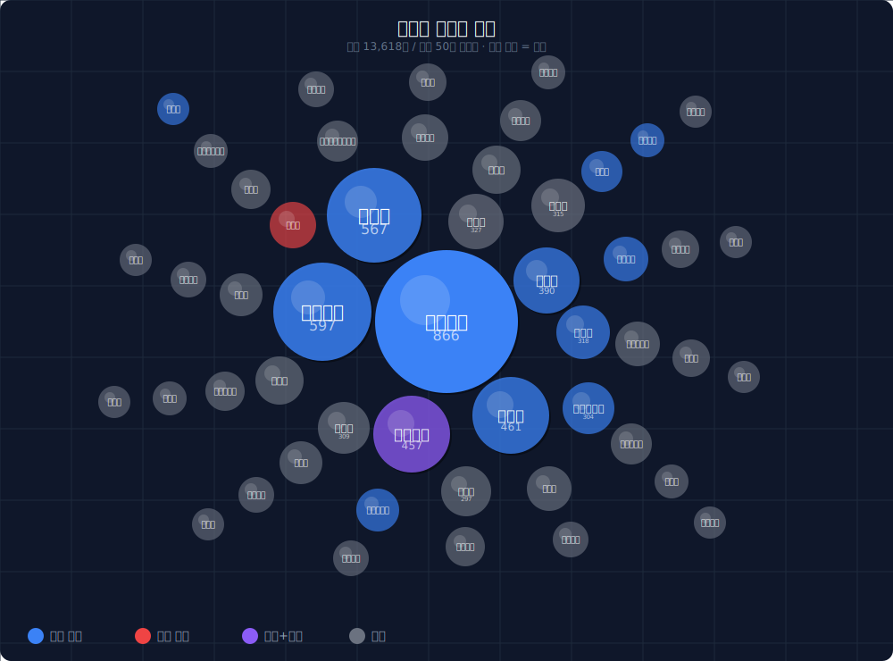

# 오세훈 AI 기반 정치인 상세평가보고서 (당사자 전용)

> 🔒 이 보고서는 당사자 전용 비공개 문서입니다.

**평가 버전**: V40  |  **평가 일자**: 2026-02-19
**총 평가 수**: 4,556개 (4 AI × 약 1,139개)
**평가 AI**: Claude · ChatGPT · Grok · Gemini

---

## 1. 정치인 프로필

| 항목 | 내용 |
|------|------|
| **이름** | 오세훈 |
| **소속 정당** | 국민의힘 |
| **현직** | 서울특별시장 |
| **지역구** | 서울특별시 |
| **이전 직책** | 제33~34대 서울특별시장 |

### 주요 경력

---

## 2. 평가 요약

### 최종 점수 및 등급

| 항목 | 내용 |
|------|------|
| **최종 점수** | **732점** / 1,000점 |
| **등급** | **P (보통+)** |
| **4 AI 평균 rating** | +1.35 → avg_score +2.69 |

> **점수 공식**: avg_rating × 2 = avg_score → (6.0 + avg_score × 0.5) × 10 = 카테고리 점수

### 10개 카테고리 점수 (높은 순)

```
비전       ████████░░ 80점
공익성      ███████░░░ 77점
소통능력     ███████░░░ 76점
전문성      ███████░░░ 75점
대응성      ███████░░░ 75점
책임감      ███████░░░ 74점
리더십      ███████░░░ 71점
투명성      ███████░░░ 71점
청렴성      ██████░░░░ 66점
윤리성      ██████░░░░ 66점
```
*(막대 1칸 = 10점)*

### AI별 점수 상세

| AI | 점수 | avg_rating | avg_score |
|---|:---:|:----------:|:---------:|
| Gemini | 755점 | +1.57 | +3.14 |
| ChatGPT | 730점 | +1.31 | +2.63 |
| Grok | 726점 | +1.27 | +2.54 |
| Claude | 717점 | +1.23 | +2.46 |
| **4 AI 평균** | **732점** | **+1.35** | **+2.69** |

### AI 합의 신뢰도

> **방향 합의** 기준: 4개 AI 모두 같은 방향(긍정/부정)으로 평가한 카테고리

- **AI 방향 합의 카테고리**: 전문성, 청렴성, 책임감 (표준편차 < 3점)
- **AI 이견 카테고리**: 공익성 (표준편차 4.6점)
- **유효 데이터**: 3,963개 / 전체 4,556개 (87.0%)

---

## 2026 서울시장 유력 후보군 비교

> ℹ️ 비교군 선정 기준: 2026 서울시장 여론조사 지지율 상위 4인 (언론 보도 기준)
> ⚠️ 평가 대상 정치인은 비교군 목록에서 자동 제외 후 별도 ★ 표시

### 종합 점수 순위

| 순위 | 후보 | 점수 | 등급 |
|:----:|------|:----:|:----:|
| 1 | 정원오 | 785점 | E (양호) |
| 2 | 박주민 | 753점 | P (보통+) |
| 3 | 조은희 | 745점 | P (보통+) |
| **★4** | **오세훈** | **732점** | **P (보통+)** |

### 카테고리별 비교 (10개)

| 카테고리 | 오세훈 | 정원오 | 박주민 | 조은희 |
|---------|:------:|:------:|:------:|:------:|
| 전문성 | 75 | 81 | 75 | 76 |
| 리더십 | 71 | 79 | 75 | 78 |
| 비전 | 80 | 76 | 75 | 74 |
| 청렴성 | 66 | 73 | 72 | 68 |
| 윤리성 | 66 | 69 | 71 | 66 |
| 책임감 | 74 | 81 | 74 | 79 |
| 투명성 | 71 | 80 | 79 | 76 |
| 소통능력 | 76 | 81 | 77 | 75 |
| 대응성 | 75 | 82 | 75 | 75 |
| 공익성 | 77 | 83 | 81 | 78 |

---

## 3. 강점 분석

### 강점 1: 비전 (80점)

#### 점수 현황
- 4개 AI 평균 **80점** — 10개 카테고리 중 **1위**
- AI별 점수: Claude 78점 · ChatGPT 81점 · Grok 80점 · Gemini 83점

#### AI 평가 일치도 (강한 합의)
- 표준편차 **2.1점**
- 최고 AI: Gemini (83점) / 최저 AI: Claude (78점) — 격차 5점

#### 등급 분포 스펙트럼
```
+4: 65건 | +3: 141건 | +2: 110건 | +1: 63건 | -1: 20건 | -2: 25건 | -3: 5건
```
- 긍정(379건 / 85%) · 부정(50건 / 11%) · 제외 X(15건)
- 극단성 지수 — 탁월(+4): 65건 / 최악(-4): 0건

### 강점 2: 공익성 (77점)

#### 점수 현황
- 4개 AI 평균 **77점** — 10개 카테고리 중 **2위**
- AI별 점수: Claude 72점 · ChatGPT 78점 · Grok 76점 · Gemini 83점

#### AI 평가 일치도 (중간 합의)
- 표준편차 **4.6점**
- 최고 AI: Gemini (83점) / 최저 AI: Claude (72점) — 격차 11점

#### 등급 분포 스펙트럼
```
+4: 31건 | +3: 118건 | +2: 151건 | +1: 69건 | -1: 19건 | -2: 23건 | -3: 7건 | -4: 2건
```
- 긍정(369건 / 78%) · 부정(51건 / 11%) · 제외 X(56건)
- 극단성 지수 — 탁월(+4): 31건 / 최악(-4): 2건

### 강점 3: 소통능력 (76점)

#### 점수 현황
- 4개 AI 평균 **76점** — 10개 카테고리 중 **3위**
- AI별 점수: Claude 76점 · ChatGPT 75점 · Grok 74점 · Gemini 79점

#### AI 평가 일치도 (강한 합의)
- 표준편차 **2.2점**
- 최고 AI: Gemini (79점) / 최저 AI: Grok (74점) — 격차 5점

#### 등급 분포 스펙트럼
```
+4: 9건 | +3: 112건 | +2: 123건 | +1: 73건 | -1: 42건 | -2: 19건 | -3: 2건
```
- 긍정(317건 / 71%) · 부정(63건 / 14%) · 제외 X(64건)
- 극단성 지수 — 탁월(+4): 9건 / 최악(-4): 0건

### 강점 4: 전문성 (75점)

#### 점수 현황
- 4개 AI 평균 **75점** — 10개 카테고리 중 **4위**
- AI별 점수: Claude 76점 · ChatGPT 76점 · Grok 74점 · Gemini 75점

#### AI 평가 일치도 (강한 합의)
- 표준편차 **1.0점**
- 최고 AI: Claude (76점) / 최저 AI: Grok (74점) — 격차 2점

#### 등급 분포 스펙트럼
```
+4: 33건 | +3: 74건 | +2: 147건 | +1: 117건 | -1: 54건 | -2: 19건 | -3: 1건
```
- 긍정(371건 / 79%) · 부정(74건 / 16%) · 제외 X(27건)
- 극단성 지수 — 탁월(+4): 33건 / 최악(-4): 0건

### 강점 5: 대응성 (75점)

#### 점수 현황
- 4개 AI 평균 **75점** — 10개 카테고리 중 **5위**
- AI별 점수: Claude 73점 · ChatGPT 72점 · Grok 74점 · Gemini 80점

#### AI 평가 일치도 (중간 합의)
- 표준편차 **3.6점**
- 최고 AI: Gemini (80점) / 최저 AI: ChatGPT (72점) — 격차 8점

#### 등급 분포 스펙트럼
```
+4: 15건 | +3: 90건 | +2: 123건 | +1: 49건 | -1: 38건 | -2: 28건 | -3: 8건
```
- 긍정(277건 / 62%) · 부정(74건 / 17%) · 제외 X(93건)
- 극단성 지수 — 탁월(+4): 15건 / 최악(-4): 0건

---

## 4. 약점 분석

### 약점 1: 투명성 (71점)

#### 점수 현황
- 4개 AI 평균 **71점** — 10개 카테고리 중 하위 **8위**
- AI별 점수: Claude 68점 · ChatGPT 72점 · Grok 72점 · Gemini 71점

#### AI 평가 편차 (강한 합의)
- 표준편차 **1.9점** — AI 간 최대 격차: 4점

#### 등급 분포 스펙트럼
```
+4: 13건 | +3: 78건 | +2: 118건 | +1: 81건 | -1: 22건 | -2: 50건 | -3: 21건
```
- 긍정(290건 / 65%) · 부정(93건 / 21%) · 제외 X(61건)
- 극단성 지수 — 탁월(+4): 13건 / 최악(-4): 0건

### 약점 2: 청렴성 (66점)

#### 점수 현황
- 4개 AI 평균 **66점** — 10개 카테고리 중 하위 **9위**
- AI별 점수: Claude 66점 · ChatGPT 65점 · Grok 67점 · Gemini 67점

#### AI 평가 편차 (강한 합의)
- 표준편차 **1.0점** — AI 간 최대 격차: 2점

#### 등급 분포 스펙트럼
```
+4: 7건 | +3: 38건 | +2: 73건 | +1: 152건 | -1: 30건 | -2: 56건 | -3: 16건 | -4: 3건
```
- 긍정(270건 / 60%) · 부정(105건 / 23%) · 제외 X(77건)
- 극단성 지수 — 탁월(+4): 7건 / 최악(-4): 3건

### 약점 3: 윤리성 (66점)

#### 점수 현황
- 4개 AI 평균 **66점** — 10개 카테고리 중 하위 **10위**
- AI별 점수: Claude 62점 · ChatGPT 66점 · Grok 66점 · Gemini 69점

#### AI 평가 편차 (강한 합의)
- 표준편차 **2.9점** — AI 간 최대 격차: 7점

#### 등급 분포 스펙트럼
```
+3: 23건 | +2: 96건 | +1: 128건 | -1: 37건 | -2: 51건 | -3: 13건
```
- 긍정(247건 / 54%) · 부정(101건 / 22%) · 제외 X(108건)
- 극단성 지수 — 탁월(+4): 0건 / 최악(-4): 0건

---

## 5. 카테고리별 상세

### 5.1 전문성 (75점)

#### AI별 등급 분포 스펙트럼

| AI | +4 | +3 | +2 | +1 | -1 | -2 | -3 | -4 | 점수 |
|---|:--:|:--:|:--:|:--:|:--:|:--:|:--:|:--:|:----:|
| Claude | 5 | 15 | 35 | 42 | 3 | 5 | 0 | 0 | 76점 |
| ChatGPT | 7 | 12 | 50 | 37 | 10 | 2 | 0 | 0 | 76점 |
| Grok | 3 | 20 | 42 | 30 | 16 | 6 | 0 | 0 | 74점 |
| Gemini | 18 | 27 | 20 | 8 | 25 | 6 | 1 | 0 | 75점 |
| **합계** | - | - | - | - | - | - | - | - | **75점** |

전체 472개: 긍정 371건(79%) · 부정 74건(16%) · X 27건(6%)

### 5.2 리더십 (71점)

#### AI별 등급 분포 스펙트럼

| AI | +4 | +3 | +2 | +1 | -1 | -2 | -3 | -4 | 점수 |
|---|:--:|:--:|:--:|:--:|:--:|:--:|:--:|:--:|:----:|
| Claude | 0 | 19 | 47 | 13 | 12 | 8 | 1 | 0 | 73점 |
| ChatGPT | 0 | 19 | 50 | 15 | 14 | 16 | 2 | 0 | 70점 |
| Grok | 0 | 26 | 38 | 9 | 18 | 19 | 1 | 0 | 69점 |
| Gemini | 5 | 32 | 28 | 14 | 10 | 16 | 5 | 0 | 72점 |
| **합계** | - | - | - | - | - | - | - | - | **71점** |

전체 472개: 긍정 315건(67%) · 부정 122건(26%) · X 35건(7%)

### 5.3 비전 (80점)

#### AI별 등급 분포 스펙트럼

| AI | +4 | +3 | +2 | +1 | -1 | -2 | -3 | -4 | 점수 |
|---|:--:|:--:|:--:|:--:|:--:|:--:|:--:|:--:|:----:|
| Claude | 3 | 30 | 36 | 23 | 6 | 5 | 0 | 0 | 78점 |
| ChatGPT | 17 | 35 | 31 | 17 | 2 | 9 | 0 | 0 | 81점 |
| Grok | 12 | 43 | 20 | 17 | 7 | 6 | 0 | 0 | 80점 |
| Gemini | 33 | 33 | 23 | 6 | 5 | 5 | 5 | 0 | 83점 |
| **합계** | - | - | - | - | - | - | - | - | **80점** |

전체 444개: 긍정 379건(85%) · 부정 50건(11%) · X 15건(3%)

### 5.4 청렴성 (66점)

#### AI별 등급 분포 스펙트럼

| AI | +4 | +3 | +2 | +1 | -1 | -2 | -3 | -4 | 점수 |
|---|:--:|:--:|:--:|:--:|:--:|:--:|:--:|:--:|:----:|
| Claude | 0 | 3 | 15 | 34 | 9 | 8 | 2 | 0 | 66점 |
| ChatGPT | 0 | 11 | 19 | 52 | 7 | 18 | 6 | 0 | 65점 |
| Grok | 0 | 13 | 17 | 35 | 10 | 14 | 3 | 0 | 67점 |
| Gemini | 7 | 11 | 22 | 31 | 4 | 16 | 5 | 3 | 67점 |
| **합계** | - | - | - | - | - | - | - | - | **66점** |

전체 452개: 긍정 270건(60%) · 부정 105건(23%) · X 77건(17%)

### 5.5 윤리성 (66점)

#### AI별 등급 분포 스펙트럼

| AI | +4 | +3 | +2 | +1 | -1 | -2 | -3 | -4 | 점수 |
|---|:--:|:--:|:--:|:--:|:--:|:--:|:--:|:--:|:----:|
| Claude | 0 | 0 | 14 | 16 | 5 | 11 | 2 | 0 | 62점 |
| ChatGPT | 0 | 4 | 28 | 49 | 9 | 15 | 4 | 0 | 66점 |
| Grok | 0 | 4 | 32 | 33 | 12 | 16 | 3 | 0 | 66점 |
| Gemini | 0 | 15 | 22 | 30 | 11 | 9 | 4 | 0 | 69점 |
| **합계** | - | - | - | - | - | - | - | - | **66점** |

전체 456개: 긍정 247건(54%) · 부정 101건(22%) · X 108건(24%)

### 5.6 책임감 (74점)

#### AI별 등급 분포 스펙트럼

| AI | +4 | +3 | +2 | +1 | -1 | -2 | -3 | -4 | 점수 |
|---|:--:|:--:|:--:|:--:|:--:|:--:|:--:|:--:|:----:|
| Claude | 0 | 6 | 32 | 28 | 4 | 4 | 0 | 0 | 73점 |
| ChatGPT | 1 | 25 | 50 | 22 | 3 | 11 | 1 | 0 | 75점 |
| Grok | 3 | 28 | 39 | 14 | 10 | 10 | 3 | 0 | 74점 |
| Gemini | 6 | 34 | 27 | 17 | 5 | 8 | 4 | 0 | 76점 |
| **합계** | - | - | - | - | - | - | - | - | **74점** |

전체 452개: 긍정 332건(73%) · 부정 63건(14%) · X 57건(13%)

### 5.7 투명성 (71점)

#### AI별 등급 분포 스펙트럼

| AI | +4 | +3 | +2 | +1 | -1 | -2 | -3 | -4 | 점수 |
|---|:--:|:--:|:--:|:--:|:--:|:--:|:--:|:--:|:----:|
| Claude | 0 | 5 | 23 | 30 | 6 | 9 | 3 | 0 | 68점 |
| ChatGPT | 0 | 28 | 38 | 20 | 5 | 14 | 5 | 0 | 72점 |
| Grok | 4 | 18 | 38 | 21 | 6 | 12 | 5 | 0 | 72점 |
| Gemini | 9 | 27 | 19 | 10 | 5 | 15 | 8 | 0 | 71점 |
| **합계** | - | - | - | - | - | - | - | - | **71점** |

전체 444개: 긍정 290건(65%) · 부정 93건(21%) · X 61건(14%)

### 5.8 소통능력 (76점)

#### AI별 등급 분포 스펙트럼

| AI | +4 | +3 | +2 | +1 | -1 | -2 | -3 | -4 | 점수 |
|---|:--:|:--:|:--:|:--:|:--:|:--:|:--:|:--:|:----:|
| Claude | 0 | 8 | 38 | 13 | 3 | 3 | 0 | 0 | 76점 |
| ChatGPT | 1 | 26 | 44 | 19 | 11 | 7 | 1 | 0 | 75점 |
| Grok | 1 | 40 | 23 | 11 | 24 | 5 | 0 | 0 | 74점 |
| Gemini | 7 | 38 | 18 | 30 | 4 | 4 | 1 | 0 | 79점 |
| **합계** | - | - | - | - | - | - | - | - | **76점** |

전체 444개: 긍정 317건(71%) · 부정 63건(14%) · X 64건(14%)

### 5.9 대응성 (75점)

#### AI별 등급 분포 스펙트럼

| AI | +4 | +3 | +2 | +1 | -1 | -2 | -3 | -4 | 점수 |
|---|:--:|:--:|:--:|:--:|:--:|:--:|:--:|:--:|:----:|
| Claude | 0 | 7 | 29 | 17 | 3 | 7 | 0 | 0 | 73점 |
| ChatGPT | 0 | 31 | 36 | 11 | 21 | 10 | 2 | 0 | 72점 |
| Grok | 0 | 24 | 34 | 14 | 11 | 6 | 1 | 0 | 74점 |
| Gemini | 15 | 28 | 24 | 7 | 3 | 5 | 5 | 0 | 80점 |
| **합계** | - | - | - | - | - | - | - | - | **75점** |

전체 444개: 긍정 277건(62%) · 부정 74건(17%) · X 93건(21%)

### 5.10 공익성 (77점)

#### AI별 등급 분포 스펙트럼

| AI | +4 | +3 | +2 | +1 | -1 | -2 | -3 | -4 | 점수 |
|---|:--:|:--:|:--:|:--:|:--:|:--:|:--:|:--:|:----:|
| Claude | 0 | 4 | 28 | 24 | 5 | 5 | 0 | 0 | 72점 |
| ChatGPT | 0 | 36 | 56 | 17 | 3 | 7 | 0 | 0 | 78점 |
| Grok | 2 | 31 | 46 | 23 | 9 | 6 | 1 | 0 | 76점 |
| Gemini | 29 | 47 | 21 | 5 | 2 | 5 | 6 | 2 | 83점 |
| **합계** | - | - | - | - | - | - | - | - | **77점** |

전체 476개: 긍정 369건(78%) · 부정 51건(11%) · X 56건(12%)

---

## 6. 키워드 지도

> 수집 데이터 1,139개 + AI 평가 reasoning 전체에서 추출 · 버블 크기 = 빈도



> 🔵 파란색 = 긍정(+3/+4) 연관 · 🔴 빨간색 = 부정(-3/-4) 연관 · 🟣 보라색 = 긍정+부정 공존 · ⚫ 회색 = 중립

### 6.1 빈출 키워드 TOP 20

| 순위 | 키워드 | 빈도 | 빈도 바 |
|:----:|--------|:----:|--------|
| 1 | **취약계층** | 866회 | ▓▓▓▓▓▓▓▓▓▓▓▓ |
| 2 | **약자동행** | 597회 | ▓▓▓▓▓▓▓▓ |
| 3 | **간담회** | 567회 | ▓▓▓▓▓▓▓ |
| 4 | **추진력** | 461회 | ▓▓▓▓▓▓ |
| 5 | **정보공개** | 457회 | ▓▓▓▓▓▓ |
| 6 | **중장기** | 390회 | ▓▓▓▓▓ |
| 7 | 정치적 | 327회 | ▓▓▓▓ |
| 8 | **이행률** | 318회 | ▓▓▓▓ |
| 9 | 강조한 | 315회 | ▓▓▓▓ |
| 10 | 가능성 | 309회 | ▓▓▓▓ |
| 11 | **공약이행률** | 304회 | ▓▓▓▓ |
| 12 | 공직자 | 297회 | ▓▓▓▓ |
| 13 | 글로벌 | 282회 | ▓▓▓ |
| 14 | 활성화 | 281회 | ▓▓▓ |
| 15 | *사회적* | 269회 | ▓▓▓ |
| 16 | 현장방문 | 269회 | ▓▓▓ |
| 17 | **해당하며** | 265회 | ▓▓▓ |
| 18 | 비전선포식 | 260회 | ▓▓▓ |
| 19 | 서울런 | 257회 | ▓▓▓ |
| 20 | **해당합니다** | 255회 | ▓▓▓ |

### 6.2 카테고리별 핵심 키워드 (TOP 5)

| 카테고리 | 1위 | 2위 | 3위 | 4위 | 5위 |
|---------|-----|-----|-----|-----|-----|
| 전문성 | 언론평(147) | 변호사(111) | 민생경제(84) | 전문적(67) | 자격증(66) |
| 리더십 | 추진력(271) | 정책추진력(138) | 장동혁(107) | 약자동행(97) | 위기대응(78) |
| 비전 | 중장기(234) | 비전선포식(160) | 서울미래인재재단(152) | 미래정책(120) | 글로벌(100) |
| 청렴성 | 공직자(112) | 재산신고(104) | 김건희(94) | 투명하게(87) | 정치자금(84) |
| 윤리성 | 박형준(149) | 품위유지(120) | 사회적(91) | 공직자(78) | 국가경영(78) |
| 책임감 | 공약이행률(223) | 이행률(195) | 공약이행(125) | 약자동행(100) | 직무수행(82) |
| 투명성 | 정보공개(251) | 공정성(103) | 회의록(83) | 디지털심사장(69) | 필요성(54) |
| 소통능력 | 간담회(234) | 적극성(102) | 토론회(87) | 경청자세(87) | 해당하며(78) |
| 대응성 | 지역현안(144) | 현장방문(110) | 현장대응(90) | 재난대응(80) | 주민참여예산(73) |
| 공익성 | 취약계층(422) | 곤돌라(127) | 남산곤돌라(119) | 공익적(111) | 중복기사(99) |

### 6.3 긍정(+3/+4) vs 부정(-3/-4) 키워드

| 순위 | 🔵 긍정 키워드 | 빈도 | 🔴 부정 키워드 | 빈도 |
|:----:|--------------|:----:|--------------|:----:|
| 1 | **취약계층** | 246 | **심각한** | 33 |
| 2 | **중장기** | 180 | **정보공개** | 33 |
| 3 | **간담회** | 156 | **정치자금법** | 30 |
| 4 | **추진력** | 132 | **정치자금법위반** | 27 |
| 5 | **약자동행** | 132 | **불구속** | 24 |
| 6 | **강력한** | 132 | **장애인** | 24 |
| 7 | **정보공개** | 105 | **혐의로** | 21 |
| 8 | **이행률** | 99 | **제기된** | 21 |
| 9 | **변호사** | 90 | **강하게** | 18 |
| 10 | **해당하며** | 90 | **부족하다** | 18 |

---

## 7. 데이터 분석

### 7.1 전체 등급 분포

| 구분 | 개수 | 비율 |
|------|:----:|:----:|
| 긍정 (+1~+4) | 3,167개 | 69.5% |
| 부정 (-1~-4) | 796개 | 17.5% |
| 제외 (X) | 593개 | 13.0% |
| **총합** | **4,556개** | **100%** |

### 7.2 카테고리별 분포

| 카테고리 | 긍정 | 부정 | 제외(X) |
|---------|:----:|:----:|:-------:|
| 전문성 | 79% | 16% | 6% |
| 리더십 | 67% | 26% | 7% |
| 비전 | 85% | 11% | 3% |
| 청렴성 | 60% | 23% | 17% |
| 윤리성 | 54% | 22% | 24% |
| 책임감 | 73% | 14% | 13% |
| 투명성 | 65% | 21% | 14% |
| 소통능력 | 71% | 14% | 14% |
| 대응성 | 62% | 17% | 21% |
| 공익성 | 78% | 11% | 12% |

### 7.3 데이터 출처

| 채널 | 총 수집 | OFFICIAL | PUBLIC |
|------|:------:|:--------:|:------:|
| Gemini CLI | 597개 | 585개 (98%) | 12개 (2%) |
| Naver API  | 542개 | 106개 (20%) | 436개 (80%) |
| **합계**   | **1139개** | - | - |

### 7.4 데이터 품질

- **총 평가 수**: 4,556개 (4 AI 합산)
- **유효 평가 (X 제외)**: 3,963개 (87.0%)
- **평가 제외 (X)**: 593개 (13.0%)
- **4 AI 평균 avg_rating**: +1.35 → avg_score +2.69

---

## 8. 평가의 한계 및 유의사항

### 데이터 수집 한계
1. **수집 기간 제한**: OFFICIAL 최근 4년, PUBLIC 최근 2년 이내 자료만 반영
2. **검색 편향**: Gemini CLI / Naver API 알고리즘에 따른 데이터 편향 가능성
3. **미수집 자료**: 비공개 문서, 오프라인 활동, 구두 발언 등 미반영

### AI 평가 한계
1. **AI 특성 편향**: 각 AI는 학습 데이터에 따른 편향 존재 (4개 평균으로 완화)
2. **맥락 이해**: 정치적 배경, 지역 특성, 역사적 맥락의 완전한 이해 불가

### 이용 시 유의사항
1. 이 보고서는 **참고 자료**입니다. 최종 판단은 이용자 본인에게 있습니다.
2. **여론조사가 아닙니다.** 등급 분포는 시민 여론과 다를 수 있습니다.
3. **법적 판단이 아닙니다.** 논란·의혹 관련 평가는 법적 유무죄와 무관합니다.
4. **실시간 업데이트 안 됩니다.** 평가 일자 이후 활동은 반영되지 않습니다.
5. **당사자 전용 문서**입니다. 무단 배포 시 법적 책임이 따를 수 있습니다.

---

## 9. 참고자료 및 마무리

### 평가 시스템 개요

| 항목 | 내용 |
|------|------|
| 수집 채널 | Gemini CLI 50% + Naver API 50% |
| 수집 기간 | OFFICIAL 4년 이내 / PUBLIC 2년 이내 |
| 평가 AI | Claude · ChatGPT · Grok · Gemini (4개) |
| 등급 체계 | +4(탁월) ~ -4(최악), X(제외) |
| 점수 공식 | `avg_rating × 2 = avg_score → (6.0 + avg_score × 0.5) × 10 = 카테고리 점수` |
| 최종 점수 | 10개 카테고리 합산, 범위 200~1,000점 |
| 비교군 선정 | 2026 서울시장 여론조사 지지율 상위 4인 (언론 보도 기준) |

### 등급 기준표

| 등급 | 점수 범위 | 의미 |
|:----:|:--------:|------|
| M  | 920~1,000점 | 최우수 |
| D  | 840~919점   | 우수 |
| E  | 760~839점   | 양호 |
| P  | 680~759점   | 보통+ |
| G  | 600~679점   | 보통 |
| S  | 520~599점   | 보통- |
| B  | 440~519점   | 미흡 |
| I  | 360~439점   | 부족 |
| Tn | 280~359점   | 상당히 부족 |
| L  | 200~279점   | 매우 부족 |

---

**생성 일시**: 2026-02-19 01:17:04
**생성 시스템**: PoliticianFinder AI 평가 엔진 V40
**보고서 유형**: Type B — 상세본 (당사자 전용 비공개)

> 🔒 이 문서는 오세훈 당사자 전용입니다. 무단 공개·배포 금지.
