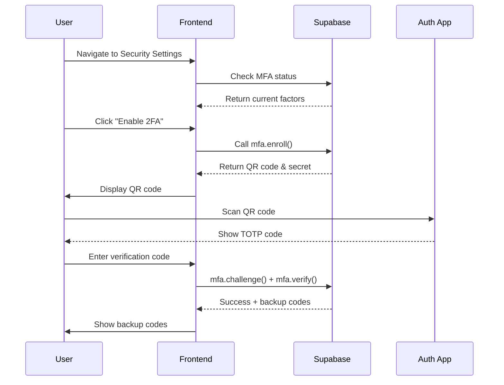
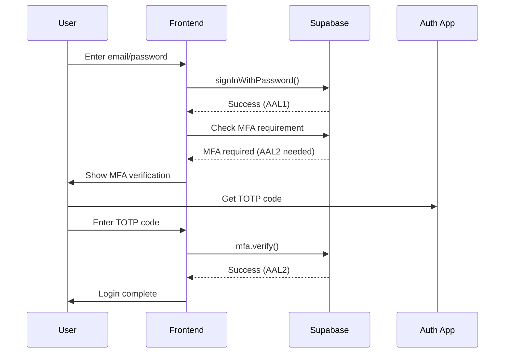

# 2FA Implementation Guide - PoliticianFinder

## Overview

This guide documents the complete Two-Factor Authentication (2FA) implementation using Supabase Auth MFA with TOTP (Time-based One-Time Password) support.

## Architecture

### System Components

```
Frontend (Next.js)
    ├── /app/settings/security         # 2FA settings page
    ├── /app/auth/mfa-verify          # MFA verification during login
    ├── /app/login                    # Updated login with MFA
    └── /components/auth
        ├── MFAVerification.tsx        # MFA verification component
        └── BackupCodesManager.tsx     # Backup codes management

Supabase Auth
    ├── MFA API
    │   ├── enroll()                  # Enroll new factor
    │   ├── challenge()               # Create challenge
    │   ├── verify()                  # Verify TOTP code
    │   └── unenroll()               # Remove factor
    └── AAL (Assurance Levels)
        ├── aal1                      # Password only
        └── aal2                      # Password + MFA
```

## User Flows

### 1. Enabling 2FA



### 2. Login with 2FA



## Implementation Details

### 1. Setting Up 2FA (`/app/settings/security/page.tsx`)

**Path**: `/settings/security`

**Features**:
- QR code generation for authenticator apps
- TOTP secret display for manual entry
- Verification before activation
- Backup codes generation
- Factor management (enable/disable)

**Key Functions**:
```typescript
// Enroll new TOTP factor
const { data } = await supabase.auth.mfa.enroll({
  factorType: 'totp',
  friendlyName: 'Authenticator App'
});

// Generate QR Code
const qrCodeDataUrl = await QRCode.toDataURL(data.qr_code);

// Verify setup
const verifyResult = await supabase.auth.mfa.verify({
  factorId: factorId,
  challengeId: challengeId,
  code: verificationCode
});
```

### 2. MFA Verification Component (`/components/auth/MFAVerification.tsx`)

**Features**:
- 6-digit code input with auto-focus
- Backup code support
- Paste support for quick entry
- Auto-submit on complete code
- Error handling with retry

**Security Features**:
- Input validation
- Rate limiting awareness
- Secure code masking for backup codes
- Clear error messages

### 3. Login Flow Updates (`/app/login/page.tsx`)

**Changes**:
- Check MFA status after password login
- Conditional MFA verification display
- Seamless transition to MFA step
- Support for both Supabase and backend auth

### 4. Authentication Context (`/contexts/AuthContext.tsx`)

**Enhanced Features**:
```typescript
interface AuthContextType {
  signInWithEmail: (email, password) => Promise<{
    requiresMFA: boolean,
    factorId?: string
  }>;
  checkMFAStatus: () => Promise<{
    enabled: boolean,
    factors: any[]
  }>;
}
```

## Security Considerations

### 1. Backup Codes

**Storage**:
- Generated using Web Crypto API
- 10 codes per set
- Format: XXXX-XXXX
- One-time use enforcement

**Best Practices**:
```typescript
// Secure generation
const randomValues = new Uint32Array(8);
crypto.getRandomValues(randomValues);

// Secure storage (production)
// - Server-side encrypted storage
// - Client-side temporary display only
```

### 2. Rate Limiting

**Implementation**:
- 5 failed attempts per 15 minutes
- Account lockout after threshold
- IP-based rate limiting
- Distributed rate limiting for scale

### 3. Session Security

**AAL Levels**:
- **aal1**: Password authentication only
- **aal2**: Password + MFA verified

**Usage**:
```typescript
// Check assurance level
const aal = await supabase.auth.mfa.getAuthenticatorAssuranceLevels();
if (aal.currentLevel === 'aal1' && aal.nextLevel === 'aal2') {
  // MFA required
}
```

## Testing

### Manual Testing Checklist

1. **Setup Flow**
   - [ ] Can enable 2FA from settings
   - [ ] QR code displays correctly
   - [ ] Manual secret entry works
   - [ ] Verification code validates
   - [ ] Backup codes generated
   - [ ] Backup codes downloadable

2. **Login Flow**
   - [ ] MFA prompted for enabled accounts
   - [ ] TOTP code accepts valid codes
   - [ ] TOTP code rejects invalid codes
   - [ ] Backup codes work once
   - [ ] Rate limiting triggers

3. **Management**
   - [ ] Can disable 2FA
   - [ ] Can regenerate backup codes
   - [ ] Can view factor status
   - [ ] Settings persist

### Automated Testing

```typescript
// Example test cases
describe('2FA Implementation', () => {
  it('should enroll TOTP factor successfully', async () => {
    // Test factor enrollment
  });

  it('should verify TOTP code correctly', async () => {
    // Test code verification
  });

  it('should handle backup codes', async () => {
    // Test backup code usage
  });

  it('should enforce rate limiting', async () => {
    // Test rate limit enforcement
  });
});
```

## Troubleshooting

### Common Issues

1. **QR Code Not Scanning**
   - Ensure good lighting
   - Check QR code size
   - Try manual secret entry

2. **Code Not Working**
   - Check device time sync
   - Verify correct app
   - Try backup code

3. **Locked Out**
   - Use backup codes
   - Contact support for reset
   - Check rate limit timeout

## Configuration

### Environment Variables

```env
# Supabase Configuration
NEXT_PUBLIC_SUPABASE_URL=your-supabase-url
NEXT_PUBLIC_SUPABASE_ANON_KEY=your-anon-key

# Optional: MFA Settings
NEXT_PUBLIC_MFA_ISSUER=PoliticianFinder
NEXT_PUBLIC_MFA_TIMEOUT=300000
```

### Supabase Dashboard Settings

1. **Enable MFA**:
   - Go to Authentication → Settings
   - Enable "Multi-Factor Authentication"
   - Configure TOTP settings

2. **Rate Limiting**:
   - Set max attempts: 5
   - Set window: 15 minutes
   - Enable account lockout

## Deployment Checklist

### Pre-Deployment

- [ ] Install required packages (`qrcode`, `@types/qrcode`)
- [ ] Configure Supabase MFA settings
- [ ] Set up environment variables
- [ ] Test all flows in staging

### Post-Deployment

- [ ] Monitor MFA adoption rate
- [ ] Check error logs
- [ ] Review support tickets
- [ ] Update documentation

## Support Documentation

### For Users

**How to Enable 2FA:**
1. Go to Settings → Security
2. Click "Enable 2FA"
3. Scan QR code with authenticator app
4. Enter verification code
5. Save backup codes

**Supported Authenticator Apps:**
- Google Authenticator
- Microsoft Authenticator
- Authy
- 1Password
- Bitwarden

**If You Lose Your Phone:**
1. Use backup codes to login
2. Disable 2FA from settings
3. Re-enable with new device

### For Developers

**Adding MFA to New Pages:**
```typescript
import { ProtectedRoute } from '@/contexts/AuthContext';

export default function SecurePage() {
  return (
    <ProtectedRoute>
      {/* Protected content */}
    </ProtectedRoute>
  );
}
```

**Checking MFA Status:**
```typescript
const { checkMFAStatus } = useAuth();
const { enabled, factors } = await checkMFAStatus();
```

## Future Enhancements

### Phase 1 (Next Sprint)
- [ ] WebAuthn support
- [ ] Push notification MFA
- [ ] Trusted device management

### Phase 2 (Q2 2025)
- [ ] Hardware security key support
- [ ] Biometric authentication
- [ ] Risk-based authentication

### Phase 3 (Q3 2025)
- [ ] Passwordless authentication
- [ ] Advanced fraud detection
- [ ] Adaptive MFA policies

## Resources

- [Supabase MFA Documentation](https://supabase.com/docs/guides/auth/auth-mfa)
- [TOTP RFC 6238](https://tools.ietf.org/html/rfc6238)
- [OWASP Authentication Cheat Sheet](https://cheatsheetseries.owasp.org/cheatsheets/Authentication_Cheat_Sheet.html)
- [NIST SP 800-63B](https://pages.nist.gov/800-63-3/sp800-63b.html)

---

**Last Updated**: 2024-10-17
**Version**: 1.0.0
**Maintainer**: PoliticianFinder Security Team